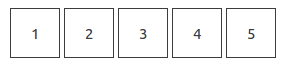

# PIN INPUT 
Create a pin input like this example   
(like when you input your pin for unlocking your phone for example)

### Minimum requirements
- Each box should only contain 1 digit (0-9)
- After filling in 1 box, focus pointer should move to very next empty box
- Input wrong character should not move to next box
- Allow secret mode -> mask all the boxes if in secret mode
- Autofocus on the first box when the pin input render
- Invoke some method after all the boxes are filled

### Plus points
- Allow to change number of input boxes (length of the pin)
- Allow pasting
- As most configurable as possible
- Allow passing regex for box input -> can no longer digit but can be other
- Default value
- Fancy UI?
- Unit test